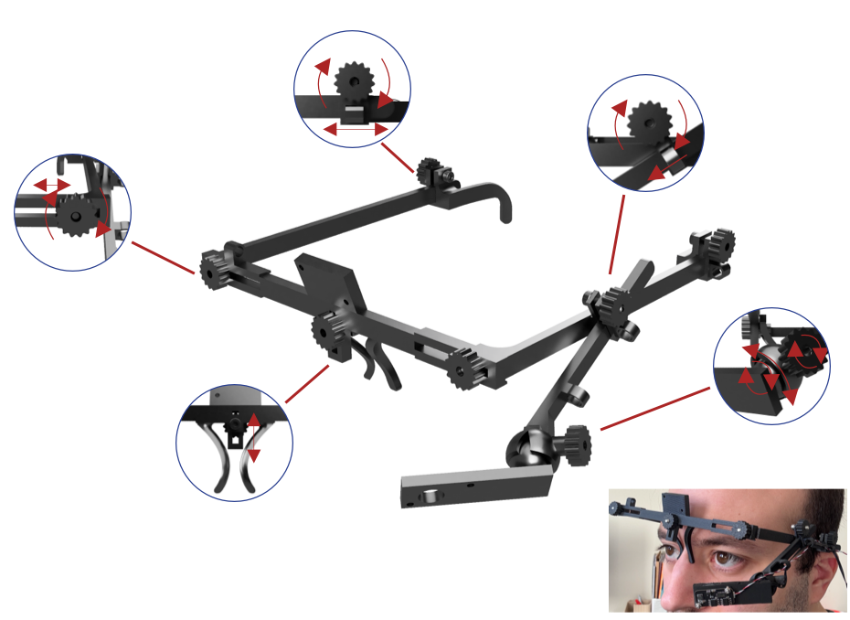
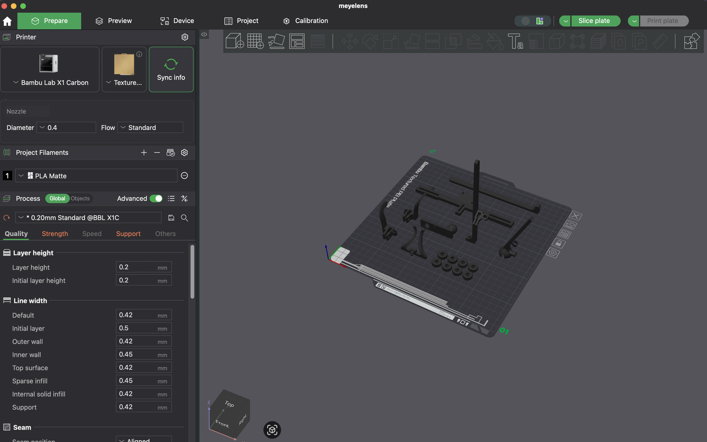
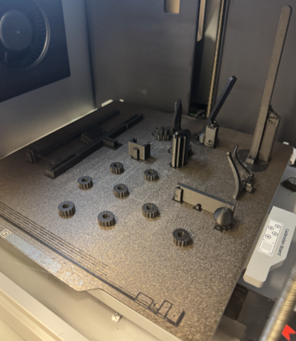
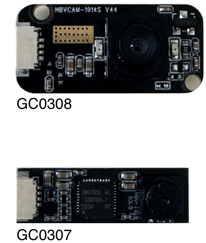
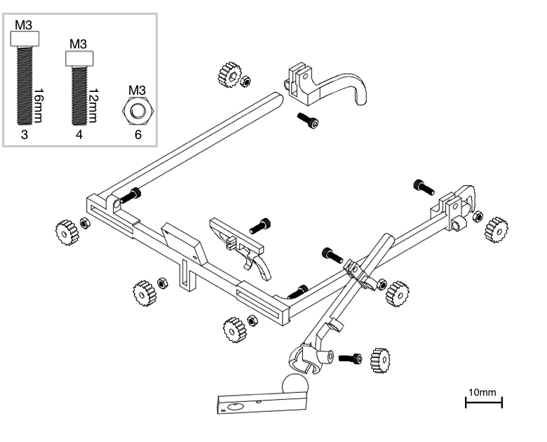
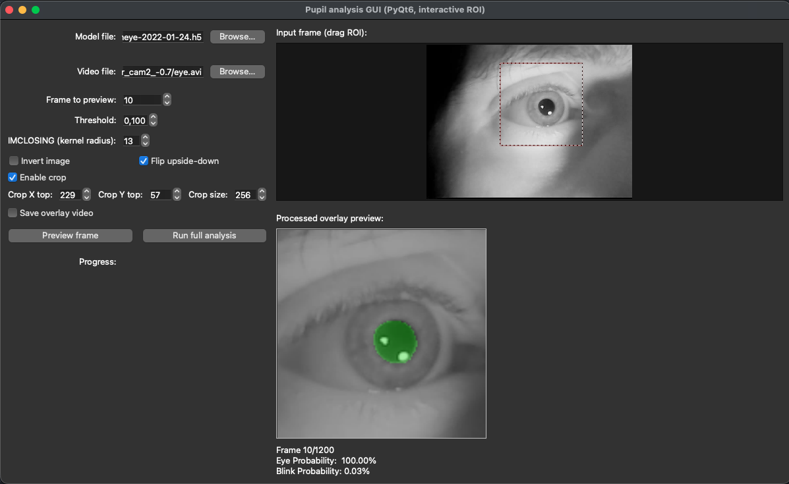

# MEYELens
**MEYELens: An Affordable, Open-Source, Fully 3D-Printable Eyewear Platform for Pupillometry and Gaze Tracking**





MEYELens is a low-cost, modular, 3D-printable eyewear platform for **pupillometry** and **gaze tracking**, designed to be reproducible and adaptable across research and clinical contexts. The project includes printable hardware, acquisition scripts, and an open-source processing toolkit (`meyelens`) providing both a **Python API** and a **GUI** for offline analysis.

This project is based on [MEYE](https://github.com/fabiocarrara/meye)

---

## 3D PRINT
3D printing files are in the `3d_print_files/` folder.

If you have a Bambu Lab printer, you can also find them on [MakerWorld](https://makerworld.com/en/models/2267867-meyelens-3d-printed-pupillometry-gaze-tracking#profileId-2471837)

<a href="https://makerworld.com/en/models/2267867-meyelens-3d-printed-pupillometry-gaze-tracking#profileId-2471837" target="_blank" rel="noopener noreferrer">
  
</a>

We used **Bambu Lab Matte Black PLA**.

Print settings (Bambu Studio baseline profile with fixed infill):
- 0.2 mm layer height, 0.4 mm nozzle
- Supports enabled, 2 wall loops
- ~50% gyroid infill (lower infill may reduce print time)
- ~55 g filament, ~3 hours (printer-dependent)




---

## CAMERAS (TESTED CONFIGURATIONS)
The platform supports:
- **Single camera**: pupillometry (optionally chin-rest gaze tracking)
- **Dual camera**: eye + world camera for naturalistic gaze tracking




Tested camera modules:
- **GC0307** (640×480, nominal 30 Hz; IR-cut removed; external 96-LED IR illuminator)
  - [AliExpress listing](https://aliexpress.com/item/1005005748547014.html)
- **GC0308** (640×480, nominal 30 Hz; built-in IR LEDs; 50° eye lens, 80° world lens)
  - [AliExpress listing](https://aliexpress.com/item/1005010597889459.html)

> Note: low-cost camera modules may not sustain the advertised FPS. In our tests, we often limited capture to **20 fps** for stability.

---

## ASSEMBLY
Assembly uses mostly standard fasteners:
- M3 × 16 mm (×3) — frame joints
- M3 × 12 mm (×4) — ear supports, camera arm, ball joint
- M3 nuts (×6) — except the ball-bearing anchor (as used in our build)
- M2 × 10 mm + M2 nuts — camera mounting

Exploded view / assembly diagram:





---

## MEYELens SOFTWARE

### Install
We recommend using a dedicated environment:

```bash
conda create -n meyelens python=3.10 -y
conda activate meyelens
pip install meyelens[tf]
```

This installs a standard TensorFlow dependency set, which may run on CPU depending on your system.

### TensorFlow GPU support (optional)
If you want to manage TensorFlow yourself (e.g., to enable GPU support), install MEYELens without TensorFlow and then follow TensorFlow’s official installation guide:

```bash
pip install meyelens
```

Then install TensorFlow following:
- https://www.tensorflow.org/install/pip

> GPU enablement depends on your OS, CUDA/cuDNN compatibility, and TensorFlow version. Follow the TensorFlow guide exactly for your platform.

### Documentation
API documentation: **[ADD DOCS LINK]**

---

## UTILIZING THE PACKAGE
We provide examples to use the library:

### `offline_recorder`
Records a video and a `.csv` with trigger markers sent through keypresses.

Controls:
- **1–9**: send trigger markers
- **S**: start recording
- **E**: stop recording
- **Q**: quit

### `online_recorder`
Same behavior, but runs **online prediction** and does **not** save the video.

### `gaze_tracking_example`
Runs a calibration process and then shows the predicted gaze on a gray background.

---

## OFFLINE GUI (PUPIL PROCESSING)
If you recorded videos through the `offline_recorder` (or have your own IR eye videos), you can run the offline GUI:

```bash
conda activate meyelens
python -m meyelens_offlinegui
```


GUI workflow:
1. Select a model file (the packaged model is detected automatically when available).

2. Select a video file.

3. Preview a frame and adjust parameters (threshold / closing / invert / flip), then drag the ROI box.

4. Run full processing.

Outputs:
- `*_pupil.csv` written next to the input video
- Optional overlay QC video (if enabled)

---

## CITATION
If you use MEYELens in your work, please cite the following papers:

**MEYELens: An Affordable, Open-Source, Fully 3D-Printable Eyewear Platform for Pupillometry and Gaze Tracking**  
G. Vecchieschi, L. Ingenito, A. Benedetto, C. Luciani, F. Carrara, G. Cioni, A. Guzzetta, T. Pizzorusso, L. Baroncelli, R. M. Mazziotti  
DOI: **[ADD LINK]**

**MEYE: Web App for Translational and Real-Time Pupillometry**  
R. Mazziotti, F. Carrara, A. Viglione, L. Lupori, L. Lo Verde, A. Benedetto, G. Ricci, G. Sagona, G. Amato, T. Pizzorusso  
eNeuro (2021) 8(5): ENEURO.0122-21.2021  
DOI: **https://doi.org/10.1523/ENEURO.0122-21.2021**


---

## LICENSE
- Code: GPL-3.0 license 
- Hardware files: CERN-OHL-P-2.0

> Without explicit licenses, reuse is legally unclear even if the project is intended to be open.

---

## CONTACT
**Raffaele M. Mazziotti**  
Email: raffaelemario.mazziotti@unifi.it

**Giacomo Vecchieschi**  
Email: giacomovecchieschi@gmail.com
