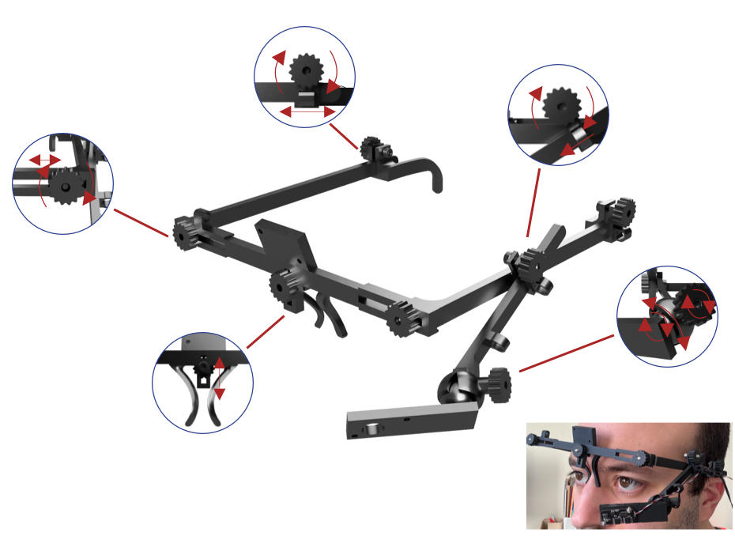

# MEYELens
**MEYELens: 3D-Printable Wearable System for Pupillometry and Gaze Tracking**

For more info visit our website [meyelens.com](https://www.meyelens.com)

## References
If you use MEYELens in your work, please cite the following papers:

**MEYELens: 3D-Printable Wearable System for Pupillometry and Gaze Tracking**  
G. Vecchieschi, L. Ingenito, A. Benedetto, C. Luciani, F. Carrara, G. Cioni, A. Guzzetta, T. Pizzorusso, L. Baroncelli, R. M. Mazziotti  
DOI: **[ADD LINK]**

**MEYE: Web App for Translational and Real-Time Pupillometry**  
R. Mazziotti, F. Carrara, A. Viglione, L. Lupori, L. Lo Verde, A. Benedetto, G. Ricci, G. Sagona, G. Amato, T. Pizzorusso  
eNeuro (2021) 8(5): ENEURO.0122-21.2021  
DOI: **https://doi.org/10.1523/ENEURO.0122-21.2021**

## LICENSE
- Code: GPL-3.0 license 
- Hardware files: CERN-OHL-P-2.0

